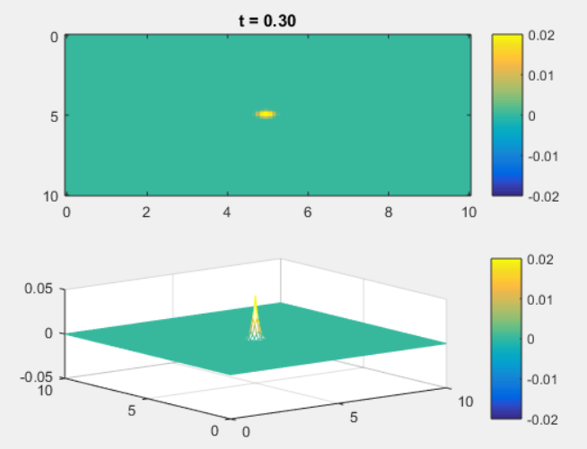
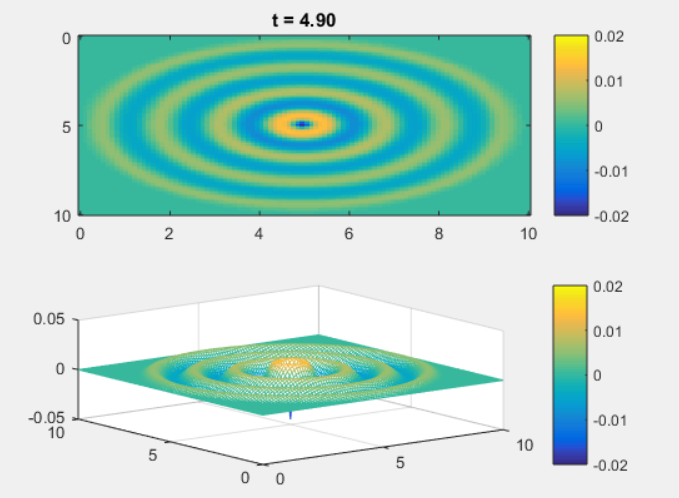

# WaveEquation_2d
Wave Equation 2D Simulation Using MATLAB
Just open wave.m with MATLAB and run.

# Wave Equation

I programmed this equation to MATLAB code.

# Visualized Graphs

Graph when t = 0.5

Graph when t = 4.9

# Customzie
Change T to modulate max time(T)
